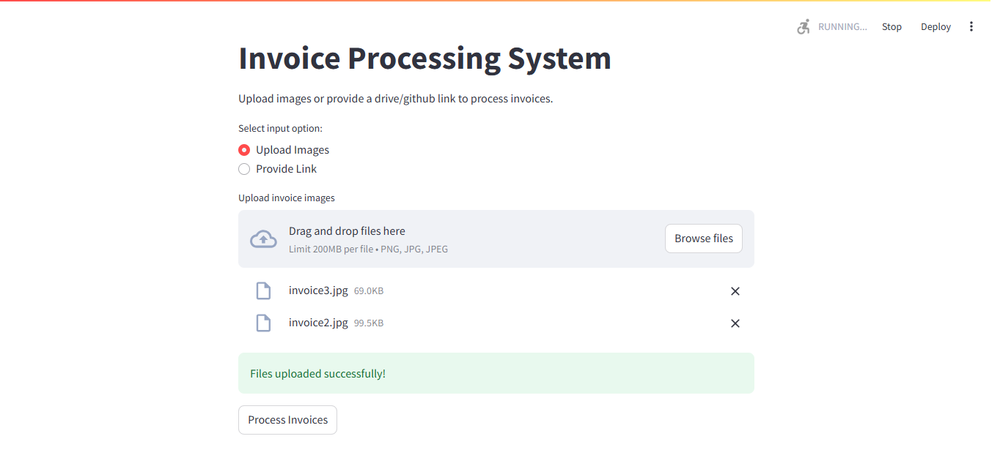
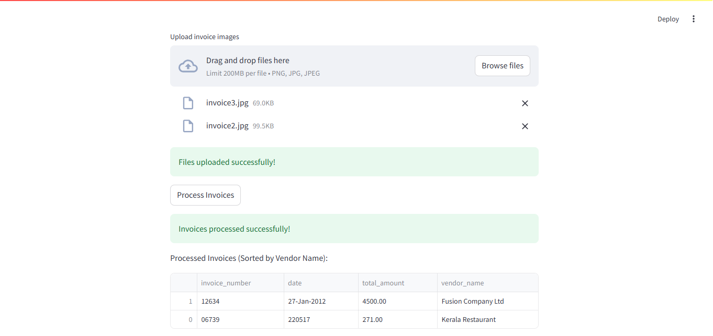

# 🚀  AI-Powered Data Extraction and Segmentation 

## Project Overview

This project is an End-to-End Document Processing and Data Extraction system designed to process scanned invoices, extract key information, and categorize them by vendor. It provides a user-friendly interface using Streamlit, allowing users to input document sources from local folders or drive links.

## 📌 Features

- **Automated Invoice Processing**: Handles scanned invoices efficiently.
- **Data Extraction**: Extracts key fields such as:
  - Invoice Number
  - Invoice Date
  - Total Amount
  - Vendor Name
- **Categorization**: Groups invoices by vendor for better organization.
- **Flexible Input Sources**: Supports data extraction from a local folder or any drive link.
- **Interactive UI**: Built using Streamlit, allowing users to provide input via:
  - Drive link
  - GitHub link for images

## Technologies Used

Over the course of development, multiple approaches were tested for document processing and information extraction:

- **OCR Techniques**:
  - Used `Tesseract` OCR combined with `regex` and `spaCy` but faced efficiency issues in handling complex invoice structures.
- **NLP & Document Understanding**:
  - Tried `LayoutLM`, but it required large transformer-based models like BERT, which made it resource-intensive.
  - Finally, switched to **Qwen/Qwen2-VL-2B-Instruct**, which provided significantly better results with improved efficiency and accuracy in extracting key invoice details.
- **Streamlit**: For the user interface.
- **Python**: Core programming language.






## 🏗️ Installation & Setup

```
    git clone https://github.com/devarajvsnd/DocumentExtraction
    cd DocumentExtraction
    pip install -r requiremnts.txt
    streamlit run app.py
```

### Problems Faced and their Solutions: 
---


- **Complex queries** - Defining a custom Query catering different types of questions, based on the application


- **Prompt-Injestion** - For Production Usecase with VLM's, facing issues of jailbreaking and prompt-injestion. A Security layer to block hitting VLM can be developed using Nemo Guardrails.

- **Latency** - This is the Major issue faced during the developement. Everytime when you hit the VLM with all local embedding downloading in the backend, A caching method can be implemented for Vlm calls and async codebase helps reducing latency and blocking for awaited independent tasks.

## 🛠️ Future Improvements

#### Fine-Tuning Qwen for Domain-Specific Invoices:

1. Train the model on a specialized dataset of invoices from multiple industries.
2. Implement domain adaptation techniques to improve extraction accuracy for different formats.
3. Leveraging a hybrid approach combining OCR for text extraction with LLMs for intelligent interpretation.
4. Database Integration: Store extracted invoice data in structured databases for seamless querying and analytics.
5. Evaluate the accuracies of the trained model on some standard datasets like CORD, STROIE, FUNSD.
6. Multi-Language Invoice Processing: Extend support to handle invoices in multiple languages for global adaptability.


#### Deployment Strategy for Streamlit and FastAPI as Docker Contaienr over AWS

To optimize deployment, both Streamlit and FastAPI applications are hosted within a single container, with each service exposing its ports independently. Supervisor can be used to manage both processes efficiently.

*Dockerfile Design*

- The FastAPI application is exposed first, serving as the backend.
- The Streamlit application is integrated within the same container, ensuring seamless interaction with FastAPI.
- The Docker image follows best practices to be lightweight, ensuring minimal memory consumption and faster build times.

This approach ensures an efficient, scalable, and production-ready deployment. 🚀


### 🔥 Scope of work

1. Deliver at least human-level accuracy
2. Can handle all sorts of data
3. Accommodate error handling
4. Check for fraud
5. Automating notification procedures depending on the results

**Devaraj V:)**

If you found this project helpful, don’t forget to star ⭐ the repository and fork it for future updates! 